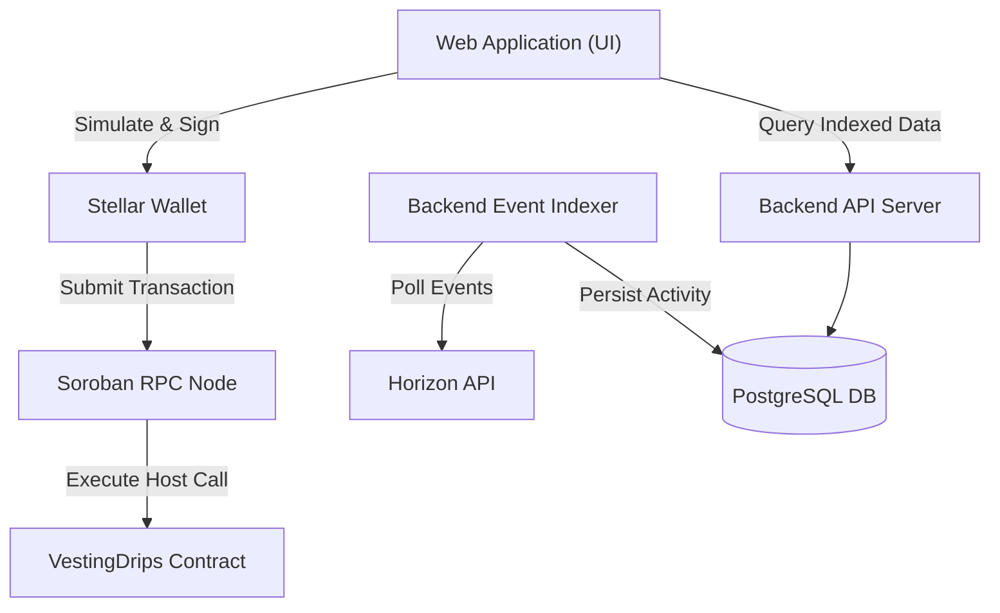

# Vesting Cliff Drip Stream

[](docs/coverage/html/index.html)

A production-ready Soroban smart contract that combines a **time-locked cliff** with **linear token streaming** for long-term contributor retention on the Stellar network.

> Coming from standard Drips? See the [comparison guide](docs/comparison.md) for a feature table, cancel behaviour details, and migration instructions.
>
> Have a question? Check the [FAQ](docs/faq.md) for common answers about stream lifecycle, claiming, token support, and fees.

---

## Concept

Standard Drips streams begin releasing tokens immediately. This contract adds a mandatory **[cliff](docs/glossary.md#cliff) period** before any tokens can be claimed, ensuring contributors remain aligned with the project before unlocking value.

For the formal lifecycle model, transition table, and error-to-state mapping, see [docs/flows.md](docs/flows.md).

```
Token Flow
──────────────────────────────────────────────────────────────────────
Ledger:   start_ledger      cliff_ledger                  end_ledger
               │                 │                              │
Tokens:        │   [locked]      │  ← instant catch-up claim → │ ← linear drip ──┤
               │                 │                              │
```

1. [Sponsor](docs/glossary.md#sponsor) deposits the **full allocation** upfront into the contract vault.
2. Recipient cannot claim anything until `cliff_ledger` is reached.
3. At the cliff, all tokens accrued since `start_ledger` are **released instantly**.
4. Remaining tokens continue to **drip linearly per [ledger](docs/glossary.md#ledger)** until `end_ledger`.

---

## Project Structure

```
.
├── Cargo.toml                     # Package manifest & dependencies
├── Makefile                       # Build / test / lint / mutants helpers
├── README.md
├── .cargo/
│   └── config.toml                # WASM build target
├── .cargo-mutants.toml            # Mutation testing exclusions & config
├── .gitignore
├── docs/
│   ├── architecture.md            # Full-stack system architecture & Mermaid diagrams
│   └── mutation/
│       └── report.md              # Mutation testing results
├── scripts/
│   ├── deploy.sh                  # Build + optimize + deploy to testnet
│   ├── invoke_create.sh           # CLI helper: create_vesting_stream
│   └── invoke_claim.sh            # CLI helper: claim_vested
└── src/
    ├── lib.rs                     # Crate root & module declarations
    ├── contract.rs                # Contract entry-points (public API)
    ├── types.rs                   # VestingSchedule & DataKey types
    ├── error.rs                   # VestingError enum (contracterror)
    ├── events.rs                  # Structured event helpers
    ├── storage.rs                 # Persistent storage read/write/TTL helpers
    └── tests/
        ├── mod.rs                 # Shared test env helpers
        ├── token_helper.rs        # SAC token creation & minting
        ├── test_create.rs         # Stream creation tests
        ├── test_claim.rs          # Claim / vesting logic tests
        ├── test_cancel.rs         # Cancellation & refund tests
        ├── test_views.rs          # Read-only view function tests
        ├── test_edge_cases.rs     # Boundary & integration scenarios
        ├── test_clawback.rs       # Clawback compliance tests (#317)
        ├── test_drain.rs          # Drain expired stream tests (#316)
        └── test_min_deposit.rs    # Minimum deposit validation tests (#314)
```


## Architecture Overview

A comprehensive full-stack architecture diagram, data flow sequences (creation, claim, cancel), backend service component breakdowns, and persistent storage layout diagrams are documented in [`docs/architecture.md`](docs/architecture.md).



## Architecture Decision Records

Key design decisions (storage layout, rate type, cliff math, error codes, TTL strategy) are documented in [`docs/adr/`](docs/adr/README.md).


## Security

For information about reporting vulnerabilities and our security policy, please see [SECURITY.md](SECURITY.md).

## Infrastructure Operations

Terraform-managed AWS infrastructure (ECS, RDS, VPC, IAM). Configuration lives in [`terraform/`](terraform/).

### Drift Detection

A [scheduled GitHub Actions workflow](.github/workflows/drift-detection.yml) runs `terraform plan` daily at **02:00 UTC** against production state. If the plan detects any changes (exit code 2), it:

1. Opens a GitHub issue labelled `infrastructure` + `drift` with the full plan output.
2. Sends a Slack alert to `#ops`.

### Operations Runbooks

| Runbook | Purpose |
|---------|---------|
| [Drift Reconciliation](docs/runbooks/drift-reconciliation.md) | How to evaluate, approve, or reject detected drift |
| [Emergency Override](docs/runbooks/emergency-override.md) | Manual infrastructure changes with required post-hoc Terraform update |
| [RDS Restore](docs/runbooks/rds-restore.md) | Database snapshot restore procedure |
| [Disaster Recovery](docs/runbooks/disaster-recovery.md) | Full system recovery scenarios |
| [Backfill Stream Events](docs/runbooks/backfill-stream-events.md) | Replay Horizon events into `stream_events` after indexer downtime or decoder fix |

See the full [runbooks index](docs/runbooks/README.md) for all operational procedures.

---

## Contract API

### `create_vesting_stream`

```rust
pub fn create_vesting_stream(
    env: Env,
    sponsor: Address,     // must sign; pays the deposit
    recipient: Address,   // beneficiary
    token: Address,       // SAC token contract
    rate: i128,           // tokens per ledger (> 0)
    cliff_duration: u32,  // ledgers until cliff
    total_duration: u32,  // total stream length (> cliff_duration)
) -> Result<(), VestingError>
```

Validates that `rate × total_duration ≥ min_deposit` (configurable, default 100).

### `claim_vested`

```rust
pub fn claim_vested(env: Env, recipient: Address) -> Result<i128, VestingError>
```

Returns the amount transferred. Fails with `CliffNotReached` before the cliff.

### `cancel_stream`

```rust
pub fn cancel_stream(
    env: Env,
    sponsor: Address,
    recipient: Address,
) -> Result<(), VestingError>
```

Cancels the stream. If the cliff has passed, the recipient keeps accrued tokens; the sponsor receives the remainder. If the cliff has not passed, the full deposit is refunded to the sponsor.

### `clawback_stream`

```rust
pub fn clawback_stream(
    env: Env,
    sponsor: Address,    // original stream funder; must sign
    recipient: Address,
    reason: String,      // compliance reason (max 256 chars)
) -> Result<(), VestingError>
```

Compliance clawback: the original sponsor recovers **all remaining tokens** in the vault, bypassing cliff state. Only available on tokens that support the SAC clawback flag. Emits `StreamClawedBack` event with the reason string.

### `drain_expired_stream`

```rust
pub fn drain_expired_stream(
    env: Env,
    caller: Address,     // any address; no auth required
    recipient: Address,
) -> Result<(), VestingError>
```

Permissionless cleanup of a fully expired stream. Available to any caller after `end_ledger + 6,307,200` ledgers (~1 year) have elapsed. Transfers remaining tokens to the original sponsor. Emits `StreamDrained` event.

### `set_min_deposit`

```rust
pub fn set_min_deposit(
    env: Env,
    admin: Address,     // must sign
    min_deposit: i128,  // new minimum total deposit (must be > 0)
) -> Result<(), VestingError>
```

Updates the minimum total deposit threshold in instance storage. Default is 100 tokens.

### View functions

| Function | Returns |
|---|---|
| `get_schedule(recipient)` | `Option<VestingSchedule>` |
| `claimable_amount(recipient)` | `i128` — `0` if cliff not reached |
| `is_cliff_passed(recipient)` | `bool` |
| `get_min_deposit()` | `i128` — current minimum deposit threshold |

---

## Error Codes

| Code | Name | Meaning |
|---|---|---|
| 1 | `ScheduleNotFound` | No active schedule for the recipient |
| 2 | `CliffNotReached` | Ledger is still before `cliff_ledger` |
| 3 | `InvalidDuration` | `total_duration` ≤ `cliff_duration` |
| 4 | `InvalidRate` | `rate` is zero or negative |
| 5 | `DepositOverflow` | Arithmetic overflow computing total deposit |
| 6 | `ScheduleAlreadyExists` | A stream already exists for this recipient |
| 7 | `NothingToClaim` | Claimable amount is zero at current ledger |
| 8 | `StreamNotExpired` | `end_ledger` has not yet been reached |
| 9 | `TransferFailed` | Token transfer failed |
| 10 | `DrainDelayNotExpired` | The 1-year drain delay after `end_ledger` has not passed |
| 11 | `InvalidRecipient` | `sponsor` and `recipient` are the same address |

---

## Quick Start

### Prerequisites

- [Rust](https://www.rust-lang.org/tools/install) with `wasm32-unknown-unknown` target
- [Stellar CLI](https://developers.stellar.org/docs/tools/developer-tools/cli/install-cli) (`stellar`)

```bash
rustup target add wasm32-unknown-unknown
```

### Build

```bash
make build
```

### Test

```bash
make test
```

CI also runs the contract test suite through Soroban's WASM runner so the
contract is exercised in the same target it is deployed to.

### Deploy to Testnet

```bash
stellar keys generate default --network testnet --fund
./scripts/deploy.sh default
```

### Invoke

```bash
export VESTING_CONTRACT=<contract-id>
export SPONSOR=default
export RECIPIENT=<G...>
export TOKEN=<C...>
export RATE=10
export CLIFF_DURATION=17280   # ~1 day at 5s/ledger
export TOTAL_DURATION=172800  # ~10 days

./scripts/invoke_create.sh
```

---

## Security Considerations

- **Auth**: Both `create_vesting_stream` ([sponsor](docs/glossary.md#sponsor)) and `claim_vested` / `cancel_stream` (respective callers) use [`require_auth()`](docs/glossary.md#auth--require_auth).
- **Overflow protection**: All arithmetic uses [checked_* operations](docs/glossary.md#checked-arithmetic), returning `DepositOverflow` on failure.
- **Overflow boundary**: The maximum valid deposit rate for a given duration is `i128::MAX / total_duration`; one unit above that returns `DepositOverflow`.
- **Duplicate prevention**: A second stream for the same recipient is rejected with `ScheduleAlreadyExists`.
- **TTL management**: [Persistent storage](docs/glossary.md#persistent-storage) entries are bumped on every read/write (~60-day window) to prevent expiry of active streams.
- **No admin backdoor**: The contract has no owner/admin key; only the original sponsor can cancel.

---

## SBOM & License Compliance

A Software Bill of Materials (SPDX 2.3 JSON) is generated for every release and attached as `sbom.spdx.json`. License scanning runs on every pull request and blocks merges if a dependency carries a copyleft or unapproved license.

See [docs/sbom.md](docs/sbom.md) for the full policy, allowed license list, and instructions for adding new dependencies.

## Changelog

See [CHANGELOG.md](CHANGELOG.md) for a full history of notable changes.

## License

MIT

## Code of Conduct

This project follows the [Contributor Covenant 2.1](CODE_OF_CONDUCT.md).
