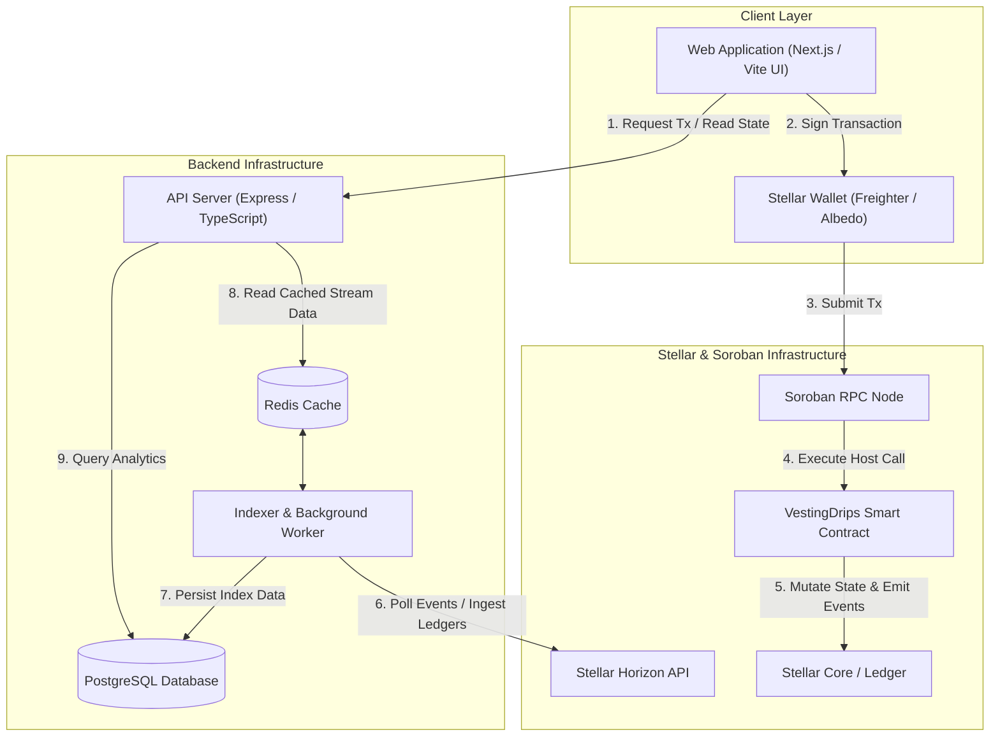
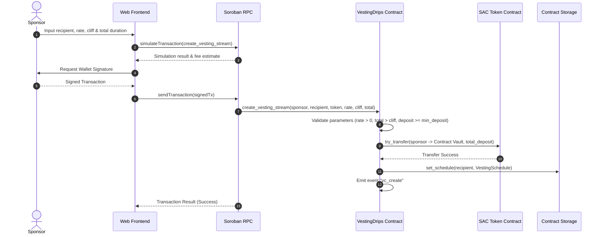
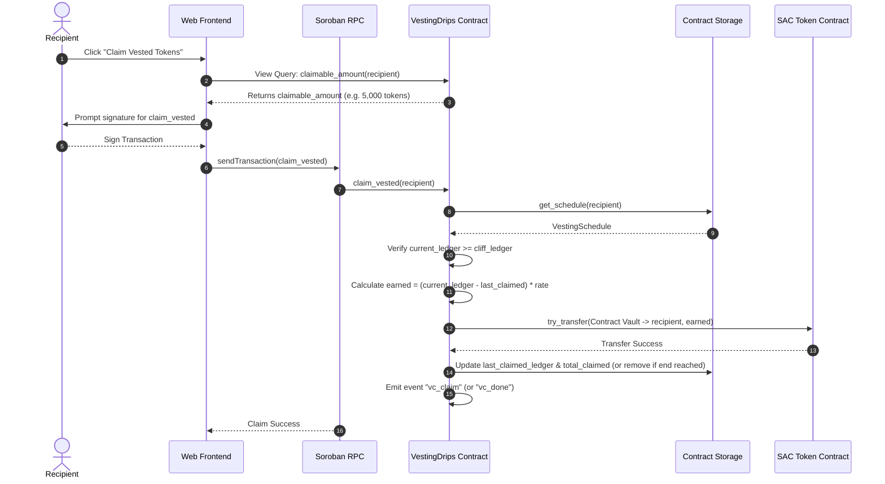
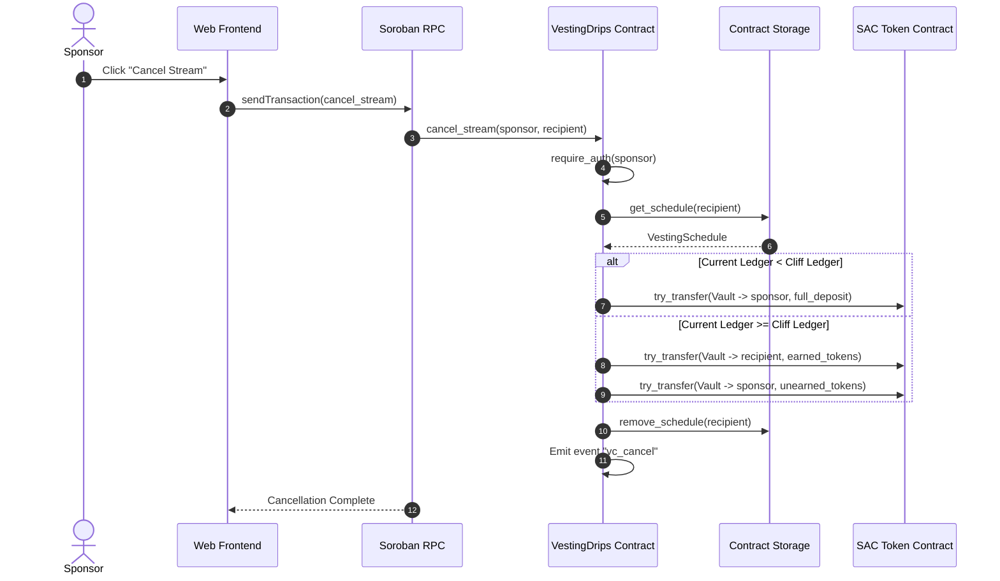
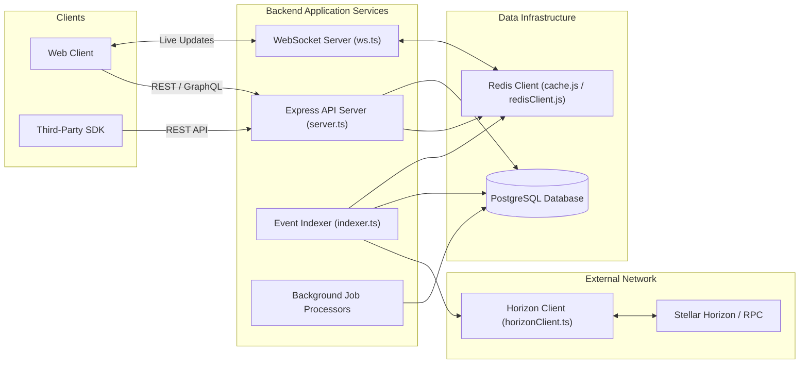
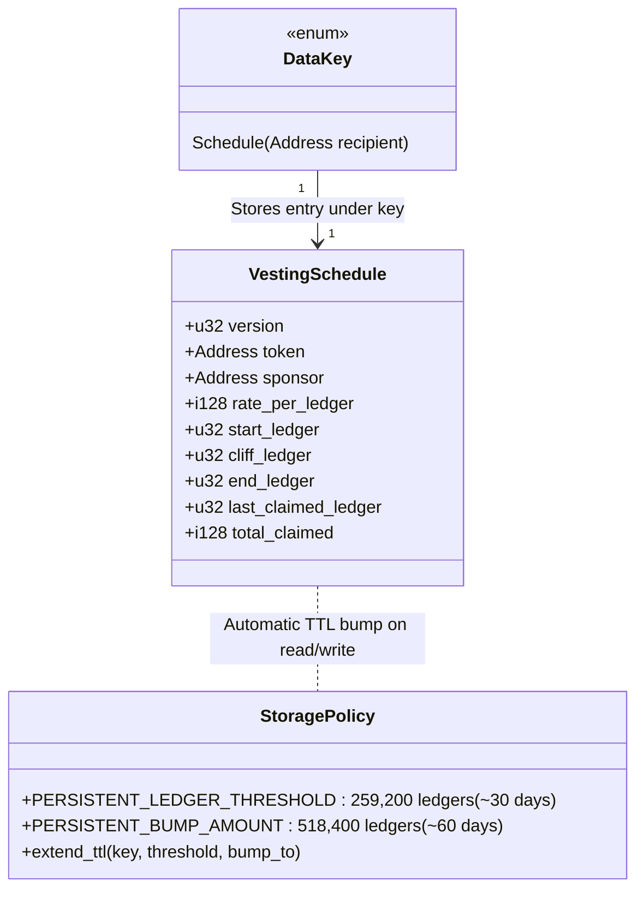

# Full-Stack System Architecture

This document provides a comprehensive architecture overview of the `VestingDrips` platform, illustrating the interaction between the frontend, backend infrastructure, Horizon / Soroban RPC, and on-chain Soroban smart contracts.

---

## Table of Contents

1. [Top-Level System Architecture](#top-level-system-architecture)
2. [Data Flow Diagrams](#data-flow-diagrams)
   - [Stream Creation Flow](#1-stream-creation-flow)
   - [Claim Vested Tokens Flow](#2-claim-vested-tokens-flow)
   - [Cancel Stream Flow](#3-cancel-stream-flow)
3. [Backend Component Diagram](#backend-component-diagram)
4. [Contract Storage Layout](#contract-storage-layout)

---

## Top-Level System Architecture

The following diagram illustrates how end users interact with the web interface, how the backend indexes on-chain activity, and how transactions flow through Horizon and Stellar RPC to the Soroban smart contract.

---

## Data Flow Diagrams

### 1. Stream Creation Flow

The sponsor specifies vesting parameters, approves the deposit, and submits the `create_vesting_stream` transaction.

---

### 2. Claim Vested Tokens Flow

The recipient initiates a claim once the cliff ledger sequence has elapsed.

---

### 3. Cancel Stream Flow

The original sponsor cancels an active stream. Unearned tokens return to the sponsor; earned post-cliff tokens remain claimable by the recipient.

---

## Backend Component Diagram

The backend service is structured into modular layers responsible for API traffic, background blockchain indexers, real-time WebSocket notifications, caching, and persistent database storage.

---

## Contract Storage Layout

`VestingDrips` utilizes Soroban `CONTRACT_DATA` persistent storage entries. Each recipient stream is isolated under its own key derived from `DataKey::Schedule(Address)`.

### Storage Characteristics

| Parameter | Value / Detail |
|---|---|
| **Storage Type** | `Persistent` (`CONTRACT_DATA`) |
| **Key Schema** | `DataKey::Schedule(recipient: Address)` |
| **Entry Size** | ~200–250 bytes per schedule |
| **TTL Bump Threshold** | 259,200 ledgers (~30 days) |
| **TTL Bump Target** | 518,400 ledgers (~60 days from current ledger) |
| **Archival Behavior** | Bumps on all reads (`get_schedule`) and writes (`set_schedule`). Expired inactive streams archive after 60 days and are automatically restored via transaction simulation preambles. |

---

## References

- [Storage Design Specification](storage.md)
- [Third-Party Integration Guide](integration-guide.md)
- [Soroban Storage Documentation](https://developers.stellar.org/docs/build/guides/storage/choosing-the-right-storage)
