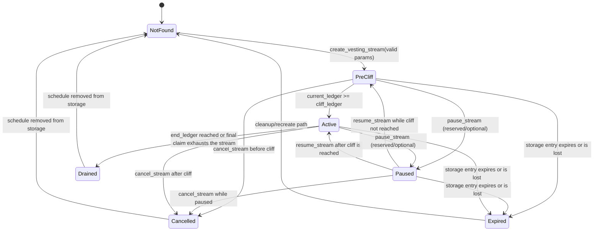
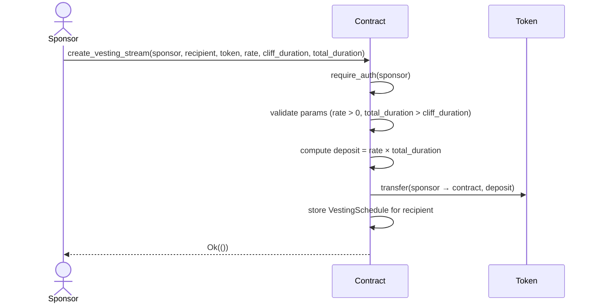
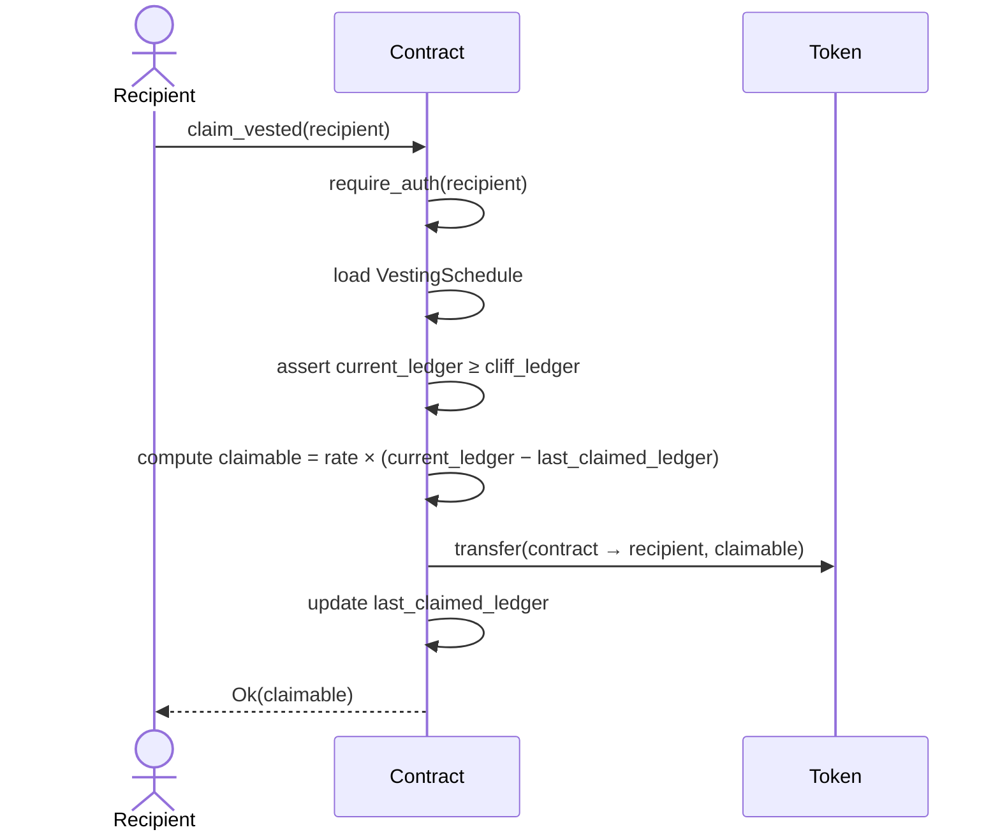
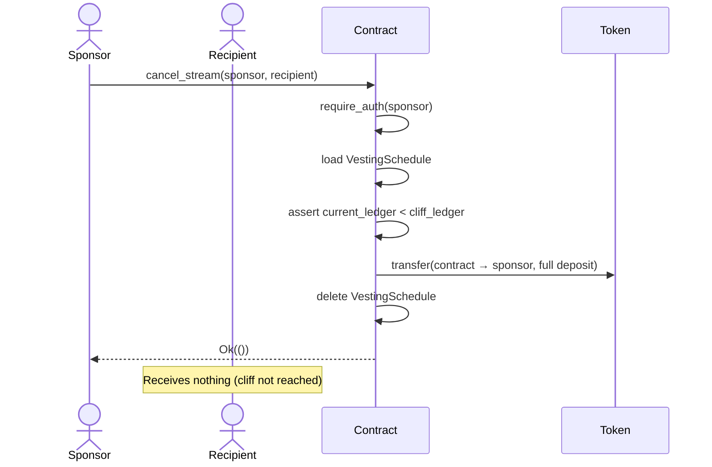
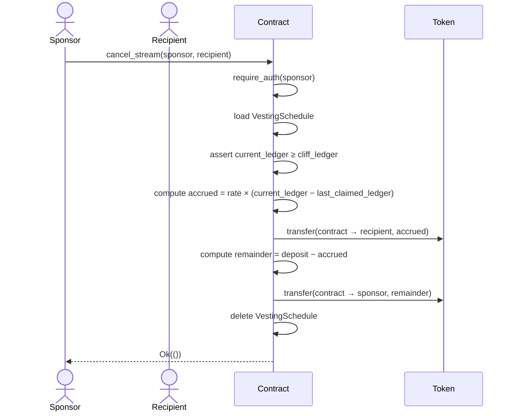

# Contract Flow Diagrams

## Lifecycle State Machine

The vesting stream lifecycle is modeled as a state machine that spans creation, cliff progression, claiming, cancellation, draining, and the documented pause/resume extension. The current contract implementation exposes the core states directly through the schedule storage and view functions; the pause/resume states are documented as a forward-compatible extension because the runtime contract does not yet implement dedicated pause entry-points.

### Mermaid state diagram

### State definitions

- NotFound
  - Entry conditions: no schedule exists for the recipient, either because it was never created or because a previous lifecycle ended and the storage entry was removed.
  - Allowed operations: create a new stream.
  - Exit conditions: successful creation transitions to PreCliff.

- PreCliff
  - Entry conditions: a stream exists and the current ledger is still before the cliff ledger.
  - Allowed operations: cancel the stream, inspect the schedule, and optionally pause/resume in a future extension.
  - Exit conditions: reaching the cliff moves the stream to Active; cancellation moves it to Cancelled; pause moves it to Paused; storage loss moves it to Expired.

- Active
  - Entry conditions: the cliff has been reached and the stream is still running before the end ledger.
  - Allowed operations: claim accrued tokens, cancel the stream, and optionally pause/resume in a future extension.
  - Exit conditions: the stream drains to Drained when the end ledger is reached or the final claim removes the schedule; cancellation moves it to Cancelled; pause moves it to Paused; storage loss moves it to Expired.

- Paused
  - Entry conditions: a pause/resume extension is enabled and the stream is temporarily halted.
  - Allowed operations: resume the stream, cancel it, and inspect status.
  - Exit conditions: resume transitions back to PreCliff or Active depending on whether the cliff is already passed; cancellation transitions to Cancelled; storage loss transitions to Expired.

- Expired
  - Entry conditions: the storage entry is no longer available because its TTL lapsed or the schedule was otherwise lost. In the current contract, this is an operational risk rather than a first-class entry-point.
  - Allowed operations: recreate the stream.
  - Exit conditions: a new creation transitions back to PreCliff.

- Cancelled
  - Entry conditions: the sponsor cancelled the stream before or after the cliff and the contract removed the schedule from storage.
  - Allowed operations: inspect historical state and create a new stream for the same recipient.
  - Exit conditions: a new creation transitions to PreCliff.

- Drained
  - Entry conditions: the stream reached its end ledger or the final claim consumed the remaining accrual and removed the schedule.
  - Allowed operations: inspect historical state and create a new stream for the same recipient.
  - Exit conditions: a new creation transitions to PreCliff.

### Transition table

| From | Action / condition | To | Notes |
|---|---|---|---|
| NotFound | create_vesting_stream with valid params | PreCliff | Stream is created and stored. |
| PreCliff | current_ledger >= cliff_ledger | Active | Cliff has been reached. |
| PreCliff | cancel_stream before cliff | Cancelled | Sponsor receives the full deposit refund. |
| PreCliff | pause_stream (future extension) | Paused | Optional pause/resume support. |
| PreCliff | storage entry expires | Expired | Operational edge case; schedule is no longer readable. |
| Paused | resume_stream and cliff not reached | PreCliff | Stream resumes before the cliff. |
| Paused | resume_stream and cliff reached | Active | Stream resumes after the cliff. |
| Paused | cancel_stream | Cancelled | Sponsor exits the paused stream. |
| Active | claim_vested until end_ledger reached | Drained | Final claim removes the schedule. |
| Active | cancel_stream after cliff | Cancelled | Recipient keeps accrued tokens; sponsor receives remainder. |
| Active | pause_stream (future extension) | Paused | Optional pause/resume support. |
| Active | storage entry expires | Expired | Operational edge case; schedule is no longer readable. |
| Cancelled | create_vesting_stream for same recipient | PreCliff | A new stream can be recreated. |
| Drained | create_vesting_stream for same recipient | PreCliff | A new stream can be recreated. |
| Expired | create_vesting_stream | PreCliff | Re-creating the stream restarts the lifecycle. |

### Invalid transitions and error mapping

| Error code | Error name | Invalid transition / trigger |
|---|---|---|
| 1 | ScheduleNotFound | `claim_vested` or `cancel_stream` executed when the stream is in NotFound, Cancelled, Drained, or Expired state. |
| 2 | CliffNotReached | `claim_vested` executed while the stream is still in PreCliff (or Paused before the cliff is reached). |
| 7 | NothingToClaim | `claim_vested` executed when the stream is Active or Paused but no additional accrual is available. |
| 6 | ScheduleAlreadyExists | `create_vesting_stream` attempted while a stream already exists in PreCliff, Active, Paused, or Cancelled/Drained history that still has an active schedule. |
| 3 | InvalidDuration | `create_vesting_stream` attempted with `total_duration <= cliff_duration`. |
| 4 | InvalidRate | `create_vesting_stream` attempted with a non-positive `rate`. |
| 5 | DepositOverflow | `create_vesting_stream` attempted with arithmetic overflow while computing the deposit. |

## 1. Stream Creation

## 2. Claim After Cliff

## 3. Cancel Before Cliff

## 4. Cancel After Cliff

